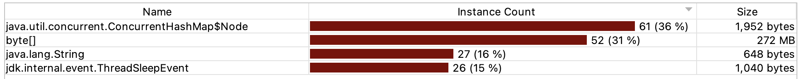
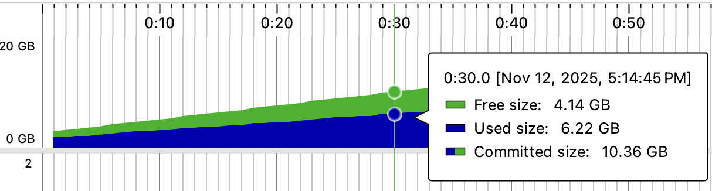
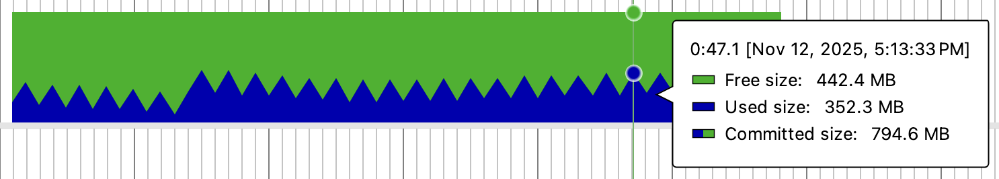

## Solution and Reasoning

### 1. Session Management

### Observations and Improvements in Original Code

ConcurrentHashMap is used in the manager, so the manager will not raise ConcurrentModificationException but there are four key issues that needs to be addressed.

1. The session manager is not singleton, because of this there is a chance that multiple session managers gets created, creating separate mapping of user id to session id for different instances.
2. In the original code the login code allows multiple threads to login under different session ids. As shown in the test function this can be an issue because multiple login attempts can lead to the generation of multiple session IDs and there is a possibility that the session stored in the calling function and our session manager is not the same.
3. Also, in the original code generic exceptions were used, I have defined pin-pointed exceptions to ensure better error analysis.
4. In the original code multiple logout queries could lead to multiple logout acknowledgements. This is solved in the current code.

**Pin-pointed tests in the test folder are created to replicate the initial problem and to see how the improved implementation solves the problem.**

**Note: In a microservice based architecture with multiple SessionManager microservices, we will use a distributed cache like Redis for session management**

### 2. Memory Management

### Memory Leak Detection

In jProfiler I tracked the memory of different objects



From here I can see that the byte[] object is taking up all the memory, and it is not releasing despite calling GC Collector. Then I went to the allocation call tree to check which call is causing this high memory utilisation


From this PNG we can see that this memory is being allocated through addSessionData. This means that we need to optimise the memory allocation here.

### Observations and Improvements in Original Code

In the initial implementation we were using a Hashmap to store and remove session data. But hashmap is not thread safe, and it does not provide any eviction strategy to handle overload. To counter these problems, I have used three strategies to counter these problems.

1. ConcurrentHashMap based data storage and removal : In this strategy we are simply adding and removing session data inside a concurrent hash map without any eviction strategy. This, despite being thread safe, does not provide any eviction strategy to counter memory leak.

2. LRU Cache Implementation in Concurrent Hashmap with TTL : In this strategy we have implemented LRU Cache mechanism using Concurrent Hashmap and Doubly Linked List. We provide the max capacity and the TTL limit while creating the instance of this cache. Then, as the cache crosses the capacity we remove elements from the tail of the doubly linked list (LRU Elements). I have also implemented a prototype of TTL Eviction, but it is not fully functional.

3. CaffeineCache : This is an in-memory caching library which supports TTL based expirations and LRU Cache based evictions out of the box.

### Improvement

Initially, we can notice that the memory usage keeps on increasing until exceeding memory limit.



After Improvement, the memory usage keeps oscillating and stays below limit.



**Tests are given in test folder for this problem, you can choose different strategies to look for memory management under different cases.**

### 3. Concurrency Problem

### Observations and Improvements in Original Code

Currently, our executor contains a producer that produces logs with equal priorities and a consumer which consumes those logs and prints the consumed log. 

Now we need to create tasks with different priorities by the producer and make the consumer consume these logs while ensuring no starvation occurs of low priority tasks. To ensure this I have used a PriorityBlockingQueue with custom Task Class, this task class decreases the priority of newly created tasks by 1 after every 100 milliseconds. This ensures new tasks has lower net priority than older tasks based on age.

```java
public class Task {

    private final PriorityEnum taskPriority;
    private final int finalPriority;
    private final String message;
    private final long createdTimeNano;

//  Hundred milliseconds (Priority decreases after 100 millisecond wait)
    private final long timeQuantam = 100000000L;

    public Task(PriorityEnum priority, String message) {
        this.taskPriority = priority;
        this.message = message;
        this.createdTimeNano = System.nanoTime();
        this.finalPriority = priority.ordinal() - (int)(createdTimeNano/timeQuantam);
    }

// Other functionality
// ....

}
```

By using this priority calculation we make sure the priority of old tasks keeps on increasing and they don't starve. You can check the execution from the LogProcessingApp in the part3ConcurrencyProblem folder.

**You can check the execution in the LogProcessingApp Class in the main package**

### 4. Deadlock Problem

### Observations and Improvements in Original Code

In the original code we can observe that there is a chance of formation of a deadlock while executing method1 and method2 in a concurrent manner.

Now one way of solving this problem would have been to reverse the order of locking in method2. 

But for the question I have assumed method1 and method2 have some external libraries which are using this locking logic, and so I can not change it. To handle this problem now, I have two approaches.

1. GlobalLock :- Before executing any one of method1 or method2. wrap the method within a global lock. By this way we can ensure either lock1 and lock2 are owned by one thread or none at all and there will no partial acquisition.

2. Trylock with retry logic :- Using trylock with some timeout, if not able to acquire any of the lock, the thread will be terminated and the process will be retried after some delay.

I have used the first approach in my code.

**You can see the safe execution through the DeadlockSafeExecutor class in the main package as well as through the tests provided in the test package. The Test Package provides comparison between the safe and unsafe executions**

### 5. Connection Pooling

### Observations and Improvements in Original Code

Our old program is having static configuration settings for HikariCP. But during high loads, if the average wait time for getting a connection is very high I want my max-thread-pool and the min number of idle connections to increase. Conversely, if avg wait is very low I want these parameters to decrease. 

For ensuring this, whenever a thread is requesting for a new connection I store the wait time to a queue. After every minute I check the average acquisition time for the last 50 samples, if this is higher than threshold, I increase the value of Max pool size and increase the minimum idle connections. The reverse logic is applied for scaling down during low average acquisition times.

**You can check this problem by running the Spring Boot application (`UnravelBackendChallengeApplication`) through run icon in IntelliJ or through the command**

```bash
mvnw spring-boot:run
```


